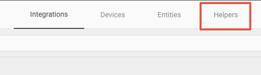

# HA Auto Refresher: Home Assistant iPad Mode Refresher

## Description
This script automatically refreshes your Home Assistant view after a set period of inactivity. It's particularly useful if you have a wall-mounted tablet that kids or others might change the view on. The script will ensure it returns to your desired view after a specified timeout.

## Features
- Automatically refreshes the Home Assistant view after a set timeout
- Periodically checks a boolean helper to enable or disable the refresh functionality.
- Logs actions and status updates in the browser console with styled messages.

## Variables

| Variable         | Example                       | Default                          | Explanation                                                                                     |
|------------------|-------------------------------|----------------------------------|-------------------------------------------------------------------------------------------------|
| `LOG_PREFIX`     | `'HA AUTO REFRESHER V1.3'`    | `'HA AUTO REFRESHER V1.3'`       | The prefix used in console log messages.                                                        |
| `REFRESH_TIME`   | `600000`                      | `600000` (10 minutes)            | Time in milliseconds to wait before refreshing the view.                                        |
| `CHECK_INTERVAL` | `60000`                       | `60000` (1 minute)               | Time in milliseconds between checks for the refresh boolean state.                              |
| `refreshEntityId`| `'input_boolean.refresh'`     | `'input_boolean.refresh'`        | Entity ID for the refresh boolean in Home Assistant.                                            |
| `token`          | `'YOUR_LONG_LIVED_ACCESS_TOKEN'`| `'YOUR_LONG_LIVED_ACCESS_TOKEN'` | Long-Lived Access Token for Home Assistant API requests.                                        |

## Installation

### Create a Long-Lived Access Token in Home Assistant

1. Go to your Home Assistant profile by clicking on your user icon in the bottom left corner.
   
2. Scroll down to the "Long-Lived Access Tokens" section.
   
3. Click on "Create Token".
4. Enter a name for your token, for example, "HA Auto Refresher".
5. Click "OK" and copy the generated token. **Save this token in a secure place**, as you will not be able to view it again.
6. Replace the `token` variable in the script with your newly created token.

### Create a Toggle Helper in Home Assistant

1. Go to Configuration > Helpers.
   
2. Click on the "+" button to add a new helper.
3. Select "Toggle" as the type of helper.
4. Enter "refresh" as the name.
5. Optionally, you can enter a description.
6. Click "Create".
   

### Include the Script in Your Dashboard

1. **Save the Script:**
   - Save the script as `ha-auto-refresher.js` in the `/config/www/` directory of your Home Assistant configuration.

2. **Add the Resource:**
   - Go to **Settings** -> **Dashboards**.
   - Click on the three dots in the top right menu.
   - Select **Resources** -> **Add Resource**.
   - Enter `/local/ha-auto-refresher.js?v=1` as the URL and select **JavaScript Module**.
   - Click **Create**.

3. **Update the Resource Version:**
   - When you make changes to the script, you need to increment the version number in the URL by one (e.g., `/local/ha-auto-refresher.js?v=2`).
   - Reload your lovelace to apply the changes. Home Assistant only recognizes changes in the file if the version number is updated.

### Example Usage

```yaml
views:
  - title: Home
    path: home
    cards:
      - type: entities
        entities:
          - entity: sun.sun
        card_mod:
          style: |
            ha-card {
              display: none;
            }
            /* Add your JavaScript here */
            <script src="/local/ha-auto-refresher.js?v=1"></script>
